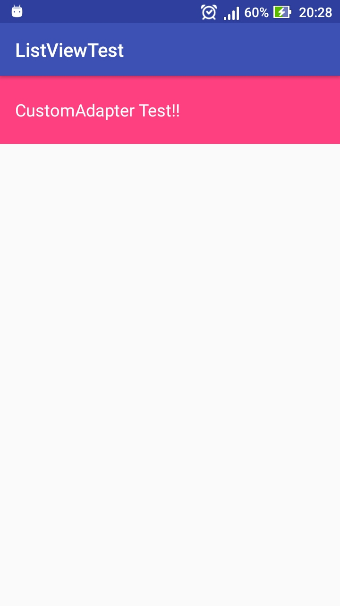
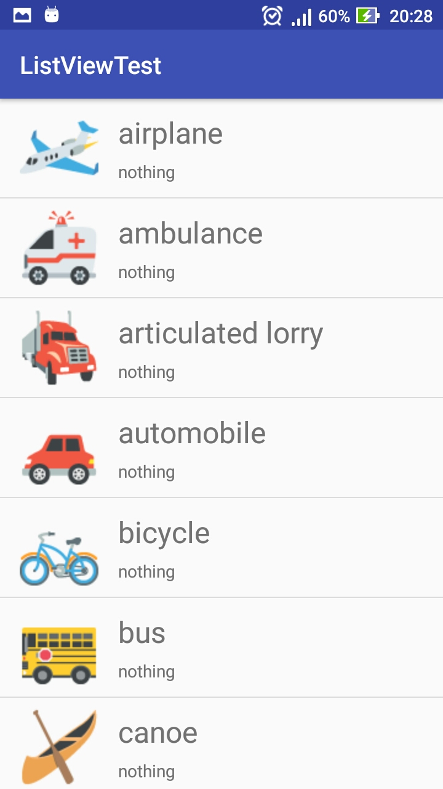
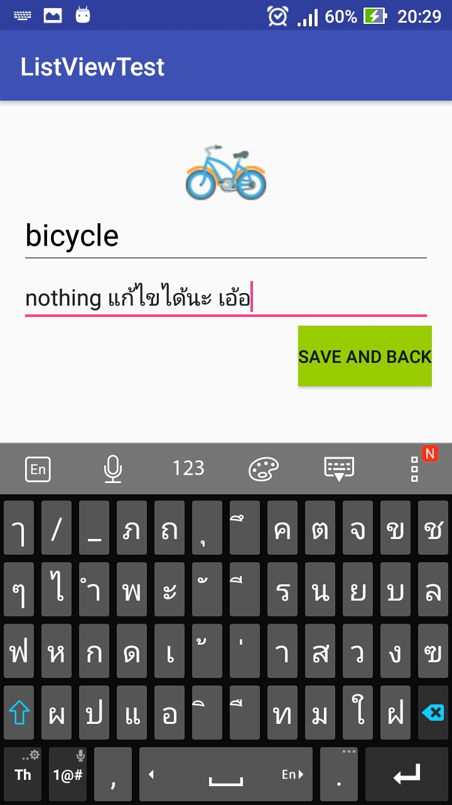
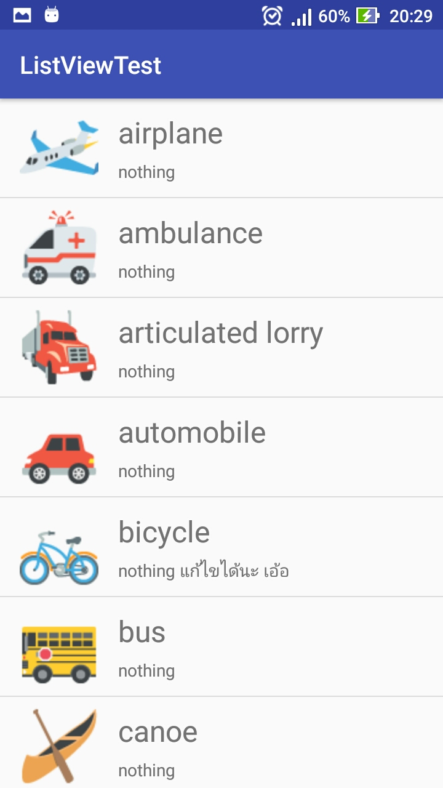

# CustomApaterTest
This is my CustomApater test

## What's about this app? (เอาภาษาไทยเหอะ)

ก็สามารถแสดง ListView แบบที่ใจเราต้องการได้ (cumtomizable)
และยังสามารถกดเข้าไปดูข้อมูล แล้วแก้ไขได้ด้วย 
จากนั้นก็กด Save แล้วมันจะกลับมาที่หน้า ListView อีกครั้ง

### Screenshot --> ดูรูปไป ดูโค้ดไปซะ

**- ๑ - หน้าแรกก็ปกติไม่มีไร พอกดแล้วก็จะไปที่ หน้า ListView**

**- ๒ - หน้าสองเป็น ListView ที่แสดงรูปและหัวข้อได้กับเนื้อหา.....หาไปเหอะไม่ได้เขียนไรไว้ (nothing)**

**- ๓ - หน้าสาม มีรูปที่เรากดเข้ามาพร้อมกับแสดงหัวข้อและเนื้อหาที่เลือก อีกทั้งกดแก้ไขได้ แล้วก็ save ซะ**

**- ๔ - หน้าสี่ ให้ดูเฉยๆ ว่ามันเปลี่ยนไปแล้ว หลังจากกด save :b**

#The end, thank for reading.

>ปล. สงสัยอะไร หลังไมค์มาถามหรือเดินมาถามได้เน้อ
